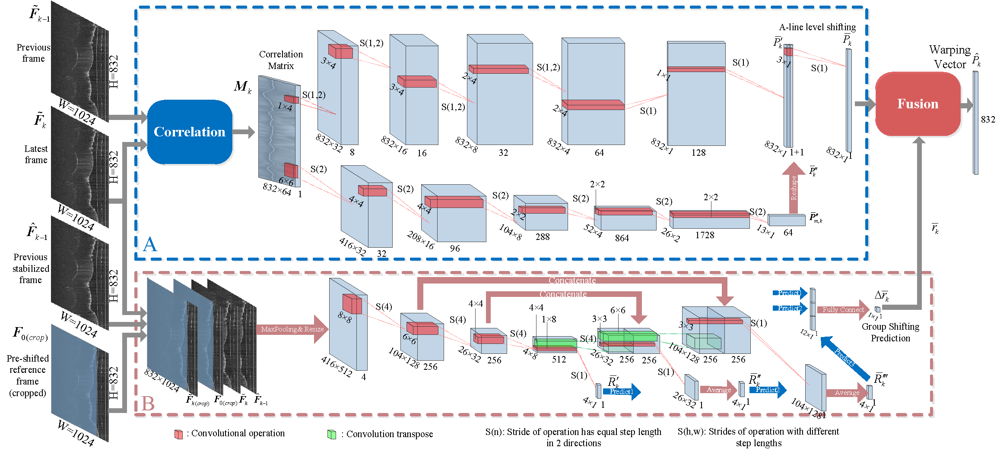
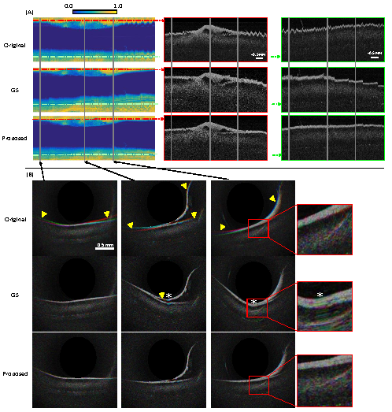

# De-NURD


> [**Distortion and Instability Compensation with Deep Learning for Rotational Scanning Endoscopic Optical Coherence Tomography**](https://www.sciencedirect.com/science/article/pii/S1361841522000081),
> Liao, Guiqiu and Caravaca-Mora, Oscar and Rosa, Benoit and Zanne, Philippe and Alba, Diego Dall and Fiorini, Paolo and de Mathelin, Michel and Nageotte, Florent and Gora, Michalina J,
> *MedIA 2022*



This package provides an implementation of the inference and training data generation pipeline of A two-branch Nonuiform rotational distortion (NURD) compensation networks for rotational scanning catheter,
This is the more acurate version that relys on Correlation Matrix, in comparison to end-to-end version
. For simplicity the model in referred as De-NURD nets.
## First time setup

The following steps are required in order to run CEnet:

1.  Install deep learning python packages(either linux or windows) .
    *   Recomended: Install anaconda
        [anaconda](https://www.anaconda.com/).
    *   install pytorch
        [pytorch](https://pytorch.org/).
    *   install mission packages (i.e. cv2, seaborn..)
        [pip install packages](https://packaging.python.org/en/latest/tutorials/installing-packages/)
        or
        [conda install packages](https://docs.anaconda.com/anaconda/user-guide/tasks/install-packages/)
1.  Organize the raw  dataset 
	
	folder structure should be like this:

	-Root 

		--Root/dataset/

			---Root/dataset/for NURD

				---Root/dataset/for NURD/train

					---Root/dataset/for NURD/train/img

					---Root/dataset/for NURD/train/label


				---Root/dataset/for NURD/test

					---Root/dataset/for NURD/test/label

					---Root/dataset/for NURD/test/label


		--Root/out

1.  Download [pre-trained model parameters] (https://seafile.unistra.fr/d/54c9103c11f142ae9dc7/)

  
 
 
## Key useful tools/python scripts
To run any runable scripts in this project,
if using the visual studio (not vs code) or pycharm, it can be run directly. 
If using vs code, please run scripts as module.
If run in terminal of linux or anaconda prompt, run as module, using following command: python3 -m subfoler.scripts(i.e. python3 -m tool.convert)

1.    De_NURD/toolfolder:


	*   cover_raw_data.py: convert raw data to fixed format for the algorithm

 


1.  In main folder(De_NURD) folder  : 

    most of these scripts are directly runnable, specifically:
 
	*   Dataset Generator.py is used to generate separated image pairs and image arrays for training two branches

	*   Dataset Generator_OLG.py is an exension of the Dataset Generator.py that deploy to generate the data on the fly (note that in training this script should be runing in parallel with the trainer code)

	*   Correct_sequence_integral.py is used to correct the NURD by a integral estimation scheme (recommended)

	*   Correct_sequence_iteration.py is used to correct the NURD with a iterative estimation scheme


## Reference

```bibtex
@article{liao2022distortion,
  title={Distortion and Instability Compensation with Deep Learning for Rotational Scanning Endoscopic Optical Coherence Tomography},
  author={Liao, Guiqiu and Caravaca-Mora, Oscar and Rosa, Benoit and Zanne, Philippe and Alba, Diego Dall and Fiorini, Paolo and de Mathelin, Michel and Nageotte, Florent and Gora, Michalina J},
  journal={Medical Image Analysis},
  pages={102355},
  year={2022},
  publisher={Elsevier}
}
```